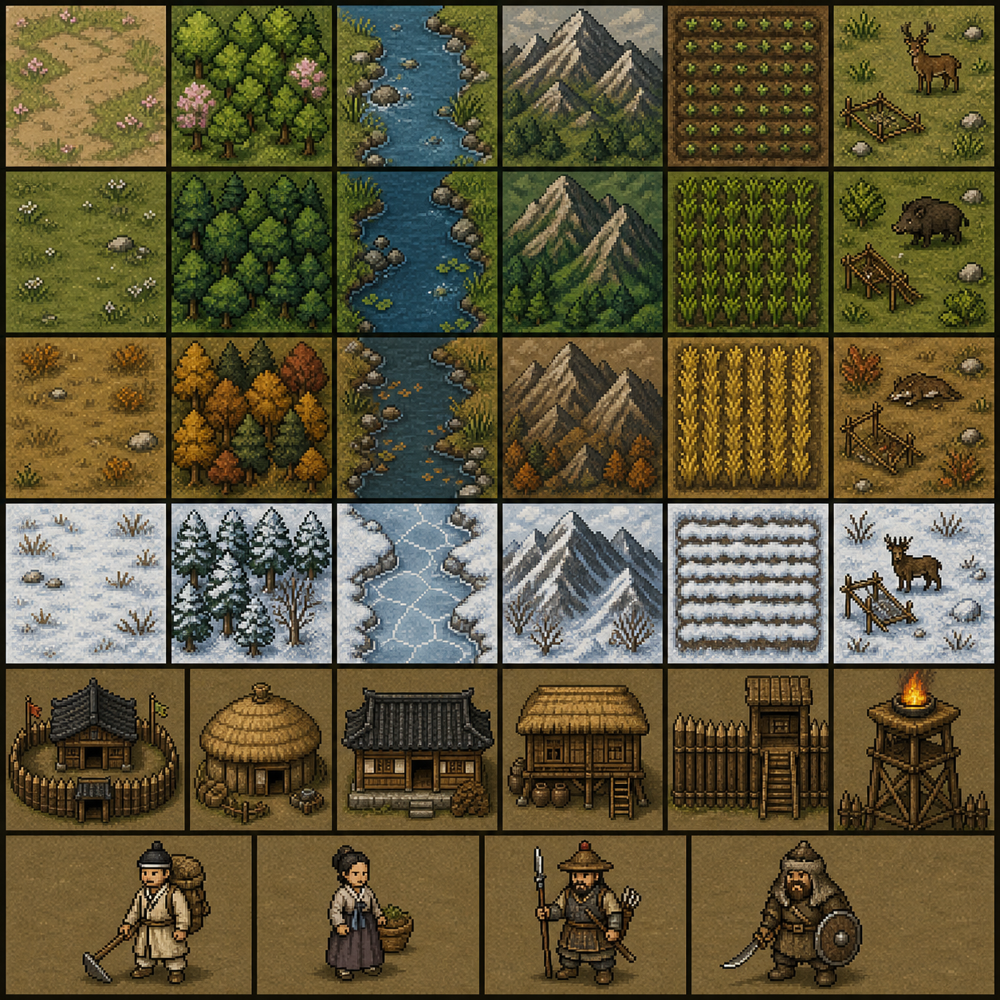
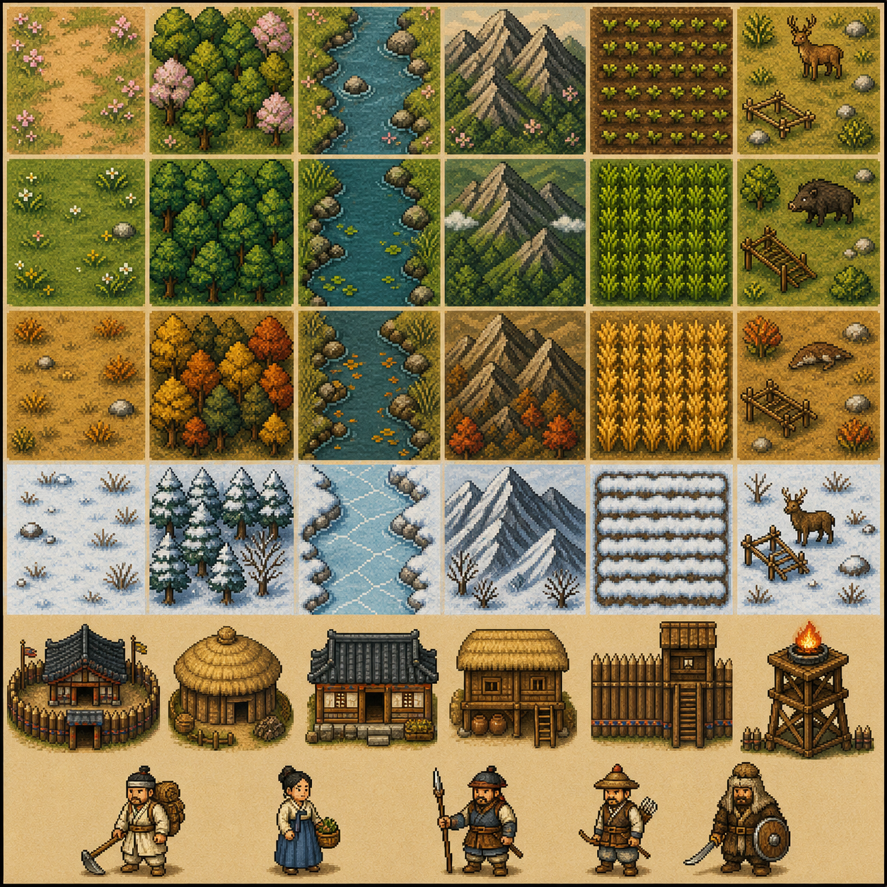
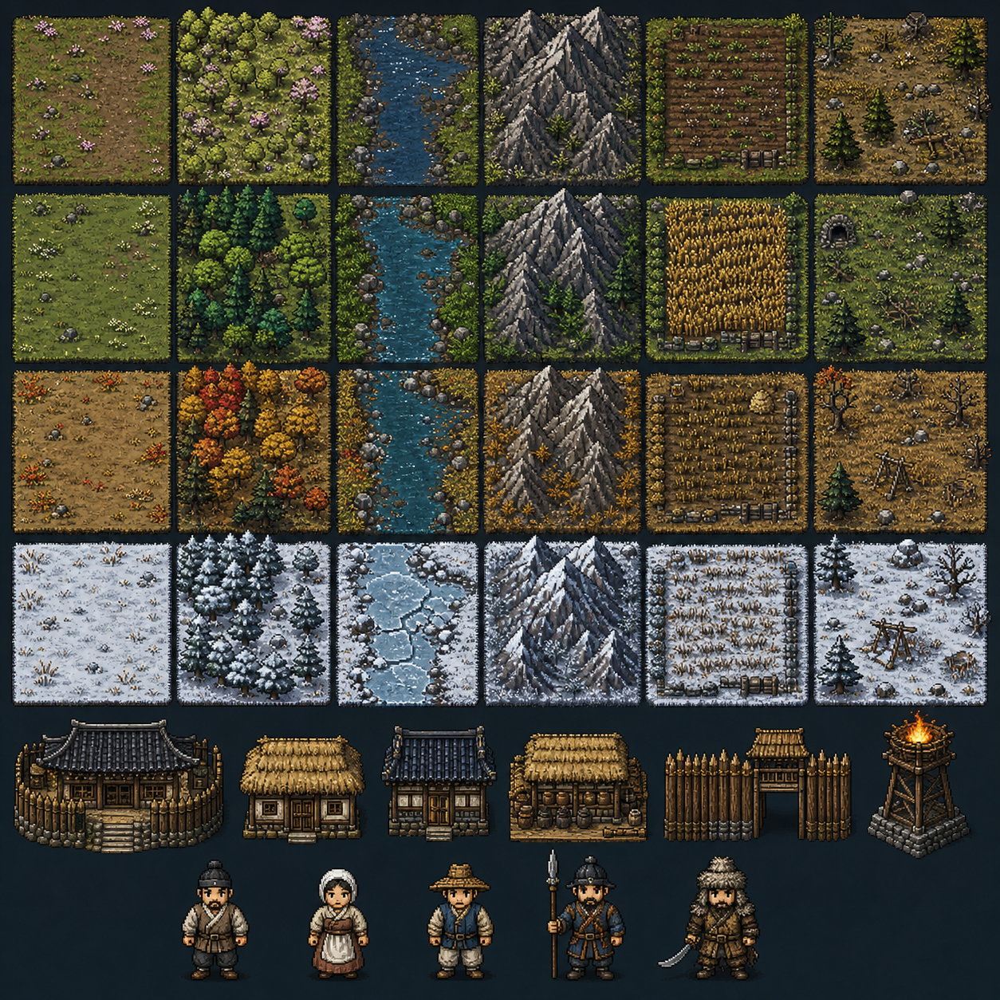

# Historical Pixel Style Board Review

## Goal

Choose the visual direction for the first custom Northern Frontier pixel-art atlas pass.

## Options

### A. Frontier Muted

Best if the project should feel restrained, grounded, and survival-focused.

### B. Folk Warm

Best if the project should feel more visibly Korean and hand-crafted while staying readable.

### C. Cold Border

Best if the project should emphasize harsh northern climate, defense, and winter readability.

## Review Criteria

- Reads clearly as late-Joseon northern frontier, not generic fantasy.
- Shows all four seasons clearly.
- Terrain categories remain distinguishable.
- Buildings have stable silhouettes suitable for future atlas extraction.
- Characters read as roles at small scale.
- The direction can work with the existing square-tile camera and `SpriteAPI` renderer.

## Review Checkpoint

After the boards are generated, choose A, B, C, or a hybrid direction such as "A palette with C silhouettes." The selected direction will become a separate style-guide task after review.
